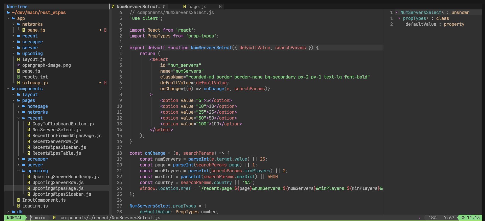

# LazyVim Ubuntu Installer

A Node.js script to automate the setup of LazyVim (Neovim config) on Ubuntu 22.04.

## Features

-   Installs Neovim with LuaJIT support
-   Sets up the JetBrains Mono Nerd Font for enhanced typography
-   Clones and configures the LazyVim repository
-   Installs and configures Language Server Protocols (LSPs) for Python and TypeScript/JavaScript
-   Installs required dependencies (Git, NodeJS, Python, Yarn)
-   Configures additional plugins like Harpoon, Tagbar, and Surround
-   Sets up custom keybinds for plugins and generic Vim/Tmux/Linux usage

## Prerequisites

Before running the setup script, ensure that your system meets the following requirements:

-   Ubuntu 22.04
-   Git (version 2 or higher)

## Setup Script Steps

-   Check for the required prerequisites
-   Install Neovim with LuaJIT support
-   Install Git
-   Set up the JetBrains Mono Nerd Font
-   Install a C compiler for nvim-treesitter
-   Install NodeJS
-   Install Python 2.7 and 3.10
-   Install Yarn
-   Install Exuberant Ctags -- Add this line
-   Clone and configure the LazyVim repository
-   Update the LazyVim configuration to install LSPs for Python and TypeScript/JavaScript
-   Configure additional plugins like Harpoon, Tagbar, and Surround
-   Set up custom keybinds for plugins and generic Vim/Tmux/Linux usage

## Script Usage

1. Open Terminal in the directory you want to save the installer
2. Clone this repository to your local machine:
   `git clone https://github.com/tsmith165/lazyvim-ubuntu-installer.git`
3. Navigate to the cloned directory:
   `cd lazyvim-ubuntu-installer`
4. Run the setup script:
   `./install.sh`
5. Once the install.sh script is successfully completed, close any open shell/ssh sessions
6. Navigate to the directory you want to start editing in
   `cd /root/dev/main/project/`
7. Launch Neovim with LazyVim by running:
   `nvim`

## Customization

If you want to customize the LazyVim configuration, you can modify the files in the `~/.config/nvim` directory.

For information on the custom keybinds and plugins, refer to the following files:

-   [Plugin and Custom Keybinds](PLUGIN_KEYBINDS.md)
-   [Generic Vim/Tmux/Linux Keybinds](GENERIC_KEYBINDS.md)

## Troubleshooting

If you encounter any issues during the setup process, please check the `debug.log` file for detailed logs and error messages.

## License

This project is licensed under the [MIT License](LICENSE).
